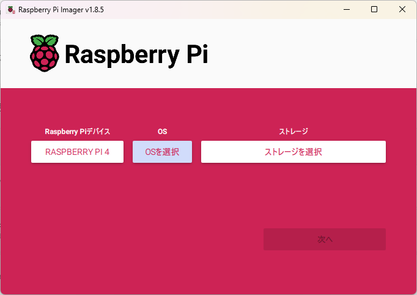
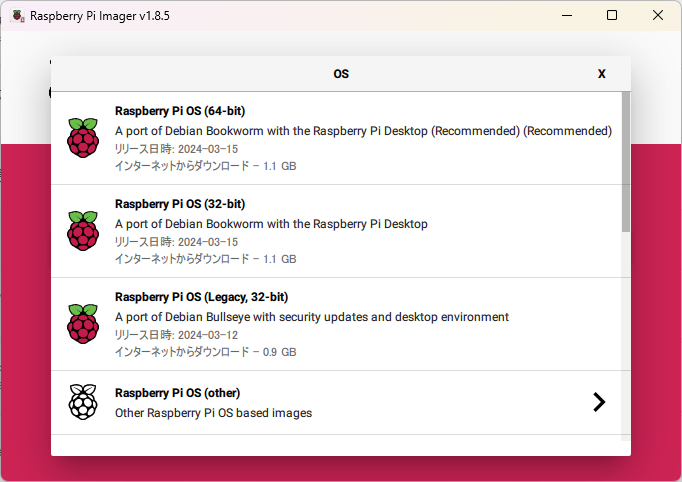
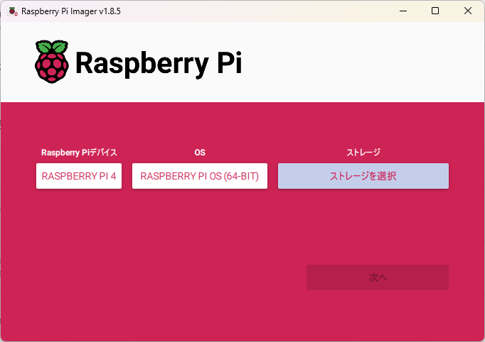
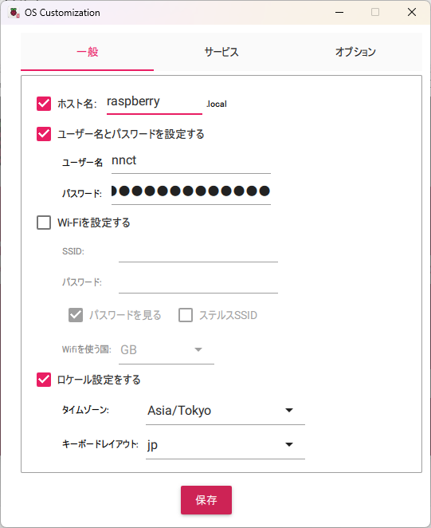
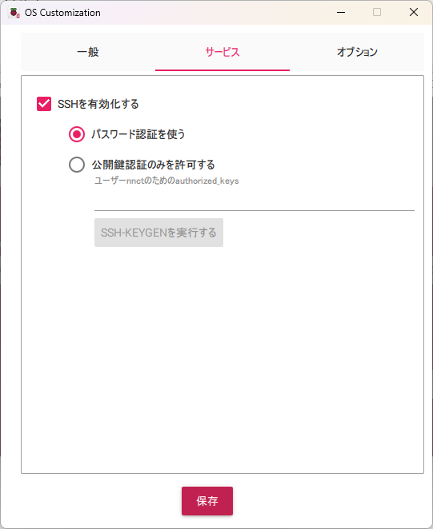
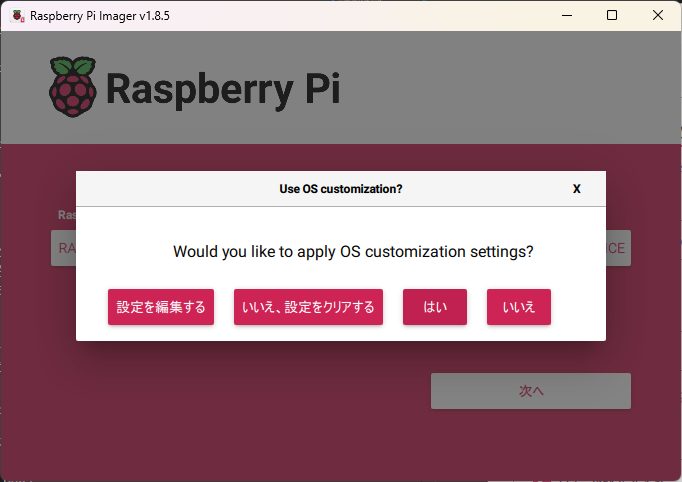

# 1. Raspberry Piのセットアップ

## 1.1. 目次

- [1. Raspberry Piのセットアップ](#1-raspberry-piのセットアップ)
  - [1.1. 目次](#11-目次)
  - [1.2. 準備するもの](#12-準備するもの)
  - [1.3. microSDカードの作成](#13-microsdカードの作成)
  - [1.4. Raspberry Pi Imagerのインストール](#14-raspberry-pi-imagerのインストール)
  - [1.5. microSDカードへの書き込み](#15-microsdカードへの書き込み)
- [2. Raspberry Piの起動と初期設定](#2-raspberry-piの起動と初期設定)
  - [2.1. 起動](#21-起動)
    - [2.1.1. ターミナルソフトウェアを使用する場合のRaspberry Piとの接続方法](#211-ターミナルソフトウェアを使用する場合のraspberry-piとの接続方法)
      - [2.1.1.1. IPアドレスの確認方法](#2111-ipアドレスの確認方法)
      - [2.1.1.2. ターミナルソフトウェアによる接続](#2112-ターミナルソフトウェアによる接続)
    - [2.1.2. 初期設定](#212-初期設定)
      - [2.1.2.1. シャットダウンと電源OFF](#2121-シャットダウンと電源off)
- [3. 最後に](#3-最後に)
- [4. 参考資料](#4-参考資料)
- [5. Linuxコマンド入門編へ](#5-linuxコマンド入門編へ)


## 1.2. 準備するもの

- 必須
    - 本体(Raspberry Pi)
    - AC電源アダプター 
    - microSDカード(16GB以上)
    - SDカードリーダーライター
- 任意
    - LANケーブル
    - PC(ディスプレイ、キーボード、マウスを接続する場合は不要)


## 1.3. microSDカードの作成

Raspberry Piで使用するmicroSDカードを作成します。

## 1.4. Raspberry Pi Imagerのインストール

はじめに、microSDカードにRaspberry Pi OSを書き込むために使用する「Raspberry Pi Imager」ソフトウェアのダウンロードを行います。「Raspberry Pi Imager」ソフトウェアは、[公式ページ](https://www.raspberrypi.com/software/)からダウンロードすることができます。


https://www.raspberrypi.com/software/


ブラウザを使用して公式ページにアクセスします。ページ下部にある「Download for Windows」ボタンをクリックします。


次に、ダウンロードした「imager_X.X.X.exe」を実行し、「Raspberry Pi Imager」をインストールします。（※アンダーバー以降は、バージョンを表しています。）
以下の画面が表示されますので、「Install」をクリックし開始します。


問題なくインストールが終了すると以下の画面が表示されますので、「Finish」をクリックし終了します。


>[!WARNING]
>以下のような警告画面が表示される場合があります。表示された場合は、「詳細情報」をクリックしてください。
>
>
>
>次に、画面下部の「実行」をクリックしてください。
>
>

## 1.5. microSDカードへの書き込み

SDカードリーダーライターに準備したmicroSDカードを挿入します。

1\. 「Raspberry Pi Imager」を実行します。

2\. 以下の画面が表示されますので、書き込みを行うRaspberry Piのモデルを選択します。「デバイスを選択」をクリックします。


3\. 以下の画面が表示されますので、あなたの「Raspberry Piのデバイス」をクリックします。


4\. 書き込みを行うOSを選択します。「OSを選択」をクリックします。ここではRaspberry Pi4を選択しているので64bitを選択しています。Raspberry Pi Zeroの場合は32bitを選択してください。





5\. 書き込みを行うmicroSDカードを選択します。「ストレージを選択」をクリックします。



6\. 書き込みを行うmicroSDカードをクリックします。

7\. Raspberry Piを使用するために必要な「ユーザーの作成」を行います。「設定を編集する」をクリックします。

TeraTermなどのターミナルソフトウェアで接続する場合は「SSHの有効化」を行います。

（※設定画面は、すべて選択し終わると表示されます。）


8\. 以下のように「詳細の設定」画面が表示されますので、「カスタマイズオプション」欄で、「このセッションでのみ有効にする」を選択します。


9\. SSHを有効化するため、「SSHを有効化する」項目にチェックマークを付けた後、「パスワード認証を使う」を選択します。

10\. ユーザーを作成するため、「ユーザー名とパスワードを設定する」項目にチェックマークを付けた後、「ユーザー名」欄に作成するユーザー名、「パスワード」欄にパスワードを入力します

**（注）パスワードの再入力欄がないため、間違わないように注意して入力してください。**

ロケールを設定するため、「ロケール設定をする」項目にチェックマークを付けた後、「タイムゾーン」欄で、「Asia/Tokyo」を選択します。「キーボードレイアウト」欄で、「jp」を選択します。





12\. 入力した内容を確認した後、「保存」をクリックします。

13\. 以下の確認画面が表示されますので、microSDカードに間違いないことを確認し、「はい」をクリックし実行します。



14\. 以下の画面が表示され、microSDカードへの書き込みが開始されます。書き込みは、Raspberry Pi OSのダウンロードとともに実行されますので、ネットワーク環境に依存しますが、書き込みが完了するまでしばらく時間がかかりますので、気長にお待ちください。


15\. 書き込みが終了すると、書き込みを行ったイメージの確認が行われますので、今しばらくお待ちください。（確認が必要ない場合は、「確認をやめる」をクリックしてください。）


16\. 書き込みが完了すると以下の画面が表示されますので、「続ける」をクリックします。


17\. 以下の画面が表示されますので、右上部の「×」をクリックし、「Raspberry Pi Imager」を終了します。

18\. 以上でmicroSDカードへの書き込みは終了です。microSDカードを取り外します。

# 2. Raspberry Piの起動と初期設定

## 2.1. 起動

Raspberry PiにmicroSDカードを取り付け、ACアダプタを接続して起動します。
（マウス、キーボード、ディスプレイを使用する場合は最初に以下のように接続してください）

<details open>

<summary>Raspberry Pi 4 / 5</summary>


</details>


<details open>

<summary>Raspberry Pi 3</summary>


</details>


<details open>

<summary>Raspberry Pi Zero W</summary>


</details>

1\. Raspberry Piに作成したmicroSDカードを取り付けます。

2\. ルータと接続されているLANケーブルをRaspberry PiのLANコネクタに接続します。（無線LANを使用する場合は不要です。）

3\. ACアダプタが電源に接続されていないことを確認した後、ACアダプタのUSBコネクタをRaspberry Piに接続します。

4\. ACアダプタを電源に接続し、Raspberry Piを起動します。（※Raspberry Piには、電源スイッチはありません。）

### 2.1.1. ターミナルソフトウェアを使用する場合のRaspberry Piとの接続方法

**※マウス、キーボード、ディスプレイを使う場合の方は読み飛ばしてください**
> [初期設定](#初期設定)

#### 2.1.1.1. IPアドレスの確認方法

コマンドプロンプトで```arp -a```を入力して、PCから見えるIPアドレスを一覧に表示します。

```cmd
C:\Users\xxx>arp -a
```

末尾の数字が一番小さいIPアドレスがルータのアドレスです。

一番最後に接続した機器のアドレスの末尾が一番大きい数字になります。

大きい数字から順にSSH(Teraterm)でログインを試してみてください。

#### 2.1.1.2. ターミナルソフトウェアによる接続

Raspberry PiのIPアドレスを確認したあと、TeraTermなどのターミナルソフトウェアを使用して、Raspberry Piに接続します。ここでは、TeraTermを使用します。

TeraTermは、Windows PCで一般的に使用されるTelnetやSSHに対応したターミナルソフトウェアです。

TeraTermを実行すると、以下の画面が表示されますので、「ホスト」欄に上記で確認したRaspberry PiのIPアドレスを入力し、「サービス」欄で「SSH」を選択し、「TCPポート#」欄に「22」を入力し、「OK」ボタンをクリックします。


次に、以下の画面が表示されますので、作成したユーザ名、パスワードを入力し、「OK」ボタンをクリックします。


問題なく接続されると以下のようなターミナルコンソール画面が表示されます。


これでターミナルソフトウェアによる接続の解説は終わりです。

### 2.1.2. 初期設定

うまく起動してデスクトップ画面が表示されたら、初期設定を行う「Welcome to the Raspberry Pi Desktop」ダイアログが表示されますので、「Next」をクリックします。


国、言語とタイムゾーンの設定です。Countryで「Japan」を選択すると、Language、Timezoneも自動的に設定されます。完了したら「Next」をクリックします。


ユーザーとパスワードの設定です。パスワードは確認のため同じものを2回入力します。2022年4月までの長らくの間、デフォルトのユーザー名は「pi」となっていました。そのため、ユーザー名piを前提とした解説記事も多く、初めての方や実験を目的とした場合はユーザー名「pi」でも良いと思います。運用などその他の目的では、セキュリティの観点から独自のユーザー名をおすすめします。

完了したら「Next」をクリックします。ユーザー名piを使用した場合は確認が出るのでOKをクリックします。


ディスプレイの外枠付近に何も表示されていない(黒くなっている)領域がある場合は、チェックします。再起動後に画面の大きさを調整してくれます。完了したら「Next」をクリックします。この画面が表示されない場合は次に進んでください。


WiFiの設定画面です。接続するWiFiのSSIDを選択します。有線接続など、WiFiを使用しない場合は「Skip」でも構いません。完了したら「Next」をクリックします。


WiFiのパスワードを入力します。完了したら「Next」をクリックします。


デフォルトブラウザーの選択画面です。「Next」をクリックします。この画面が表示されない場合は次に進んでください。


アップデートには多少(30分程度)時間がかかります。進捗が表示された後、完了すると以下の画面になるので「OK」をクリックします。


Setup Completeのダイアログが表示されたら完了です。「Restart」をクリックすると再起動します。


再起動後にデスクトップ画面が表示されれば、初回起動時の初期設定は終了です。

#### 2.1.2.1. シャットダウンと電源OFF

最後に、シャットダウンと電源OFFする方法を説明します。

画面左上のRaspberry Piのロゴをクリックすると、メニューが表示されるので、「ログアウト」をクリックします。


すると以下のようなダイアログボックスが表示されるので、「Shutdown」をクリックします。


Raspberry Piがシャットダウンを開始するので終了するまで待ちましょう。緑色のLEDが全く点滅しなくなったらシャットダウンが終了しています。デバイスや動作しているソフトによりますが、すぐに終了することもあれば、１〜２分程度かかる場合もあります。

電源は自動で切れないので、シャットダウンの終了を確認した後に電源ケーブルを抜きます。

# 3. 最後に 
ハードウェアのセットアップとOSの初期設定方法の解説は以上です。これでRaspberry Piを使う準備が整いました。Raspberry Piはソフトや拡張基板を追加することで様々な応用が可能です

# 4. 参考資料
- https://www.ingenious.jp/articles/howto/raspberry-pi-howto/raspberry-pi-basic-setup/#toc21
- https://www.indoorcorgielec.com/resources/raspberry-pi/raspberry-pi-setup/

# 5. [Linuxコマンド入門編へ](/GetStart/getstart.md)